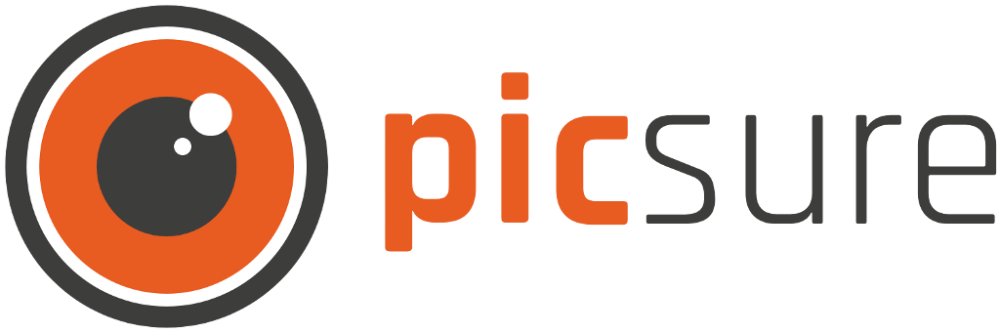

[](#carthage)


Picsure generates insurance proposals based on image informations within seconds. This is the worldwide first AI in the insurance business based on image recognitions. We are providing our White-Label-API for insurance companies. Which allows them to create a new and full digital sales channel for their customers.

### Requirements ###

* Swift 4.0+
* iOS 8.0+

## Installation ⚙️ ##

#### [CocoaPods](https://guides.cocoapods.org/using/using-cocoapods.html)

```ruby
# Podfile
use_frameworks!

target 'YOUR_TARGET_NAME' do
    pod 'Picsure', '~> 1.1.0'
end
```

Replace `YOUR_TARGET_NAME` and then, in the `Podfile` directory, type:

```bash
$ pod install
```

#### [Carthage](https://github.com/Carthage/Carthage)

Add this to `Cartfile`:

```
github "picsure/picsure-sdk-ios" ~> 1.1.0
```
And then, in the `Cartfile ` directory, type:

```bash
$ carthage update --platform iOS
```

## Usage 🚀 ##

Picsure SDK is as simple as possible. There are two main methods.

First, you have to initalize Picsure SDK with your API key.

```swift
Picsure.configure(withApiKey: "YOUR_API_KEY")
```
then just recognize the needed photo:

```swift
Picsure.upload(photo) { result in
    // check result or error ...
    // result - enum with two cases: success(json), failure(error).
}
```

You can configure the response language with a language identifier(ISO 4217):

```swift
Picsure.configure(language: "de")
```


Default identifier is 'en'.

**NOTE:** Picsure needs to access the user’s Photos library to read EXIF data. Don't forget to request it before using:

```swift
import Photos

PHPhotoLibrary.requestAuthorization { status in
	print(status)
}
```

This is an example result JSON:
```json
{
  "object_recognition": [
    {
        "label": "Camera",
        "category": "camera",
        "subcategories": [],
        "price_indication": {
            "CHF": 560
        }
    },
    {
        "label": "Nikon D500",
        "category": "camera",
        "subcategories": [
            "nikon-d500",
            "nikon"
        ],
        "price_indication": {
            "CHF": 2393
        }
    },
    {
        "label": "Nikon D5",
        "category": "camera",
        "subcategories": [
            "nikon-d5",
            "nikon"
        ],
        "price_indication": {
            "CHF": 7639
        }
    },
    {
        "label": "DSLR Camera",
        "category": "camera",
        "subcategories": [
            "dslr-camera"
        ],
        "price_indication": {
            "CHF": 664
        }
    }
  ],
  "fraud_detection": {
        "exif_data_found": true,
        "location": {
            "lat": 50.717777777777776,
            "lng": 7.152222222222223
        },
        "create_date": "2017-11-29T10:15:25+00:00",
        "modify_date": "2017-11-29T10:15:25+00:00",
        "upload_date": "2018-01-19T14:29:33+00:00",
        "found_in_web": false,
        "days_photo_taken": 51,
        "days_photo_updated": 51,
        "is_modified": false
    }
}
```

## Licence

```
MIT License

Copyright (c) 2018 Picsure

Permission is hereby granted, free of charge, to any person obtaining a copy
of this software and associated documentation files (the "Software"), to deal
in the Software without restriction, including without limitation the rights
to use, copy, modify, merge, publish, distribute, sublicense, and/or sell
copies of the Software, and to permit persons to whom the Software is
furnished to do so, subject to the following conditions:

The above copyright notice and this permission notice shall be included in all
copies or substantial portions of the Software.

THE SOFTWARE IS PROVIDED "AS IS", WITHOUT WARRANTY OF ANY KIND, EXPRESS OR
IMPLIED, INCLUDING BUT NOT LIMITED TO THE WARRANTIES OF MERCHANTABILITY,
FITNESS FOR A PARTICULAR PURPOSE AND NONINFRINGEMENT. IN NO EVENT SHALL THE
AUTHORS OR COPYRIGHT HOLDERS BE LIABLE FOR ANY CLAIM, DAMAGES OR OTHER
LIABILITY, WHETHER IN AN ACTION OF CONTRACT, TORT OR OTHERWISE, ARISING FROM,
OUT OF OR IN CONNECTION WITH THE SOFTWARE OR THE USE OR OTHER DEALINGS IN THE
SOFTWARE.
```
